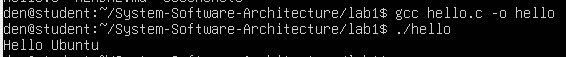

# Практична робота з Linux та GitHub №1

Цей репозиторій містить покроковий опис виконання практичної роботи з встановлення та налаштування операційної системи Ubuntu у віртуальній машині VirtualBox, а також базову роботу з Git і GitHub.

## Мета роботи 

Ознайомитися з процесом встановлення та запуску операційної системи Ubuntu Linux і налаштувати базове середовище для програмування мовами C/C++.

## Середовище виконання

- Хостова операційна система: Windows  
- Віртуалізація: Oracle VirtualBox  
- Гостьова операційна система: Ubuntu 24.04 LTS  

## Встановлення операційної системи

Операційна система Ubuntu 24.04 LTS була встановлена у віртуальній машині VirtualBox.  
Під час встановлення було обрано стандартні параметри, створено користувача та налаштовано базові системні опції.

## Особливості встановлення Ubuntu 24.04 LTS

Під час встановлення операційної системи Ubuntu 24.04 LTS було виявлено, що дана версія є більш чутливою до якості та стабільності мережевого зʼєднання.  
Процес встановлення декілька разів завершувався з помилкою на етапі встановлення ядра системи.

Помилка виникала під час виконання операції встановлення пакета ядра Linux (`installing kernel`), що призводило до переривання інсталяції.  
Імовірною причиною є нестабільне або повільне мережеве зʼєднання, оскільки інсталятор активно завантажує пакети з мережі під час встановлення.

Для порівняння, версія Ubuntu 22.04 LTS встановлювалася без подібних проблем у тій самій віртуальній машині та за аналогічних налаштувань, що свідчить про більшу стабільність попередньої версії в умовах обмеженого або нестабільного інтернет-зʼєднання.

## Аналіз проблеми встановлення

На основі проведених спроб встановлення можна зробити висновок, що Ubuntu 24.04 LTS має вищі вимоги до стабільності мережевого зʼєднання під час інсталяції, особливо на етапі встановлення ядра системи.  
У випадку нестабільного інтернет-зʼєднання доцільно використовувати більш стабільну версію Ubuntu 22.04 LTS або забезпечити надійний провідний доступ до мережі.

## Оновлення системи

Після встановлення операційної системи було виконано початкове оновлення системи за допомогою наступної команди:

```bash
sudo apt update && sudo apt upgrade -y  
```


На скріншоті показано результат виконання команди оновлення системи, що підтверджує актуальний стан пакетів.
### Встановлення драйверів

Для автоматичного встановлення рекомендованих драйверів була використана команда:

```bash
sudo ubuntu-drivers autoinstall 
```


На скріншоті відображено процес автоматичного встановлення рекомендованих драйверів.
Після успішного встановлення драйверів потрібне перезаванатження системи за допомогою команди:

```bash
sudo reboot  
```
## Встановлення інструментів для програмування

Для підготовки середовища розробки було встановлено базовий набір інструментів:

```bash
sudo apt install build-essential git -y
```

На скріншоті показано успішне встановлення базових інструментів для програмування.
## Виконання першої програми мовою C

### Створення файлу

Для створення програми було використано текстовий редактор `nano`:

```bash
nano hello.c
```
```bash
#include <stdio.h>

int main() {
    printf("Hello Ubuntu\n");
    return 0;
}
```
Файл було збережено за допомогою комбінацій клавіш:

Ctrl + O → Enter

Ctrl + X

### Компіляція та запуск програми

Компіляція програми виконувалась за допомогою компілятора `gcc`:

```bash
gcc hello.c -o hello
```
Запуск скомпільованої програми:
```bash
./hello
```

Очікуваний результат виконання програми:


На скріншоті відображено результат виконання першої програми мовою C.
## Проблема авторизації GitHub у VirtualBox та її вирішення

Під час виконання практичної роботи виникла проблема з авторизацією при виконанні команди `git push` з віртуальної машини Ubuntu до репозиторію GitHub.  
Авторизація через HTTPS із використанням пароля або Personal Access Token не працювала коректно, що ускладнювало синхронізацію змін з віддаленим репозиторієм.

Причиною проблеми є особливості авторизації GitHub через HTTPS, а також обмежена робота буфера обміну у VirtualBox, що ускладнює введення токенів вручну.

### Рішення: використання SSH-зʼєднання

Найбільш надійним і зручним способом вирішення проблеми є використання SSH-зʼєднання для роботи з GitHub.

#### Створення SSH-ключа у віртуальній машині

```bash
ssh-keygen -t ed25519 -C "your_email@example.com"
```
Під час створення ключа всі параметри можна залишити стандартними (натискати Enter).

Додавання ключа до ssh-agent
```bash
eval "$(ssh-agent -s)"
```
```bash
ssh-add ~/.ssh/id_ed25519
```
Додавання SSH-ключа до GitHub
Публічний ключ виводиться командою:
```bash
cat ~/.ssh/id_ed25519.pub
```
Отриманий ключ необхідно додати на GitHub:

Settings → SSH and GPG keys → New SSH key

Перевірка зʼєднання з GitHub
```bash
ssh -T git@github.com
```
У разі успішного підключення зʼявиться повідомлення про успішну автентифікацію.

Перемикання репозиторію з HTTPS на SSH
```bash
git remote set-url origin git@github.com:USERNAME/REPOSITORY.git
```
Після цього команда git push виконується без введення логіна, пароля або токенів.

## Основні команди Linux

| Команда | Призначення |
|--------|------------|
| `ls` | перегляд списку файлів |
| `cd` | перехід між каталогами |
| `pwd` | визначення поточного каталогу |
| `nano` | редагування файлів |
| `gcc` | компіляція програм |
| `./імʼя` | запуск програми |


