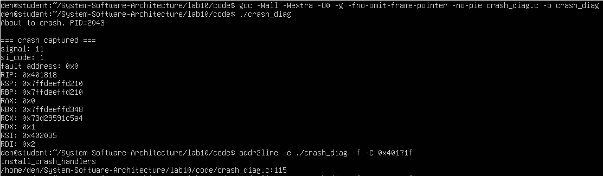
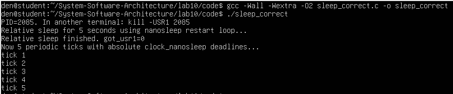
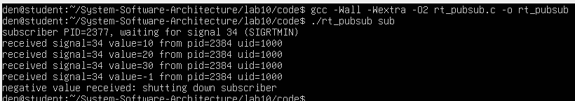
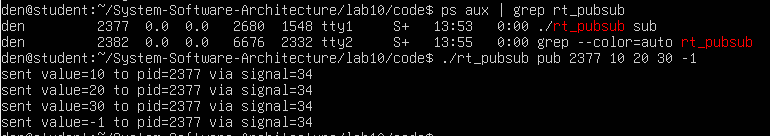
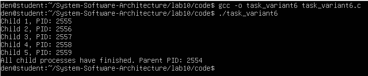

# Практична робота №10
## Обробка аварійних завершень процесів, діагностика crash-ситуацій, real-time signals, передавання сигналів, publisher-subscriber приклад, альтернативні техніки signal handling, sigwaitinfo() і sigtimedwait().

### Мета роботи
У цій лабораторній роботі досліджуються основні техніки обробки аварійних завершень процесів, робота з реальними сигналами, передавання сигналів між процесами за допомогою моделі publisher-subscriber, а також використання альтернативних методів обробки сигналів, таких як sigwaitinfo() та sigtimedwait().

## Завдання 10.1 
У цьому завданні програма реалізує обробку аварійних завершень процесів, зокрема, сегментаційних помилок (SIGSEGV), і виводить діагностичну інформацію про помилки, такі як значення регістрів процесу.

### Код програми
Код програми розміщено у файлі: code/crash_diag.c.c

### Компіляція програми
```
gcc -Wall -Wextra -O0 -g -fno-omit-frame-pointer -no-pie crash_diag.c -o crash_diag
```
### Запуск програми
```
./crash_diag
```
### Результати виконання
Після запуску програма викликає аварійну ситуацію (сегментаційна помилка) і виводить дамп регістрів процесу, включаючи адреси та значення, з якими стався збій:



Програма також виводить інформацію про реєстри процесу: RIP, RSP, RAX, RBX, RCX тощо.

## Завдання 10.2  
У цьому завданні було реалізовано використання nanosleep() для циклічного сну з відновленням, а також використання clock_nanosleep() для сну з абсолютними значеннями. Програма також обробляє сигнали SIGUSR1 для переривання сну.

### Код програми
Код програми розміщено у файлі: code/sleep_correct.c

### Компіляція програми
```
gcc -Wall -Wextra -O2 sleep_correct.c -o sleep_correct
```
### Запуск програми
```
./sleep_correct
```
### Результати виконання
Програма чекає сигнал SIGUSR1 з іншого термінала. Після отримання сигналу програма відновлює свій цикл сну:



## Завдання 10.3  
У цьому завданні реалізовано publisher-subscriber модель, що використовує реальні сигнали для передачі даних між процесами. Підписник чекає на сигнали від видавця та обробляє їх за допомогою sigwaitinfo() та sigtimedwait().

### Код програми
Код програми розміщено у файлі: code/rt_pubsub.c

### Компіляція програми
```
gcc -Wall -Wextra -O2 rt_pubsub.c -o rt_pubsub
```
### Запуск програми
```
./rt_pubsub sub
```
### Результати виконання

Термінал 1 (підписник):
Підписник чекає на сигнал SIGRTMIN і виводить отримані значення:



Термінал 2 (виконавець):
Видавець відправляє сигнали:



## Завдання task_variant6.c 
У циклі створіть 5 дочірніх процесів. Кожен з них має вивести свій номер та завершитись. Батьківський процес чекає завершення всіх.

### Код програми
Код програми розміщено у файлі: code/task_variant6.c

### Компіляція програми
```
gcc -o task_variant6 task_variant6.c
```
### Запуск програми
```
./task_variant6
```

### Результати виконання
Після запуску програма створює 5 дочірніх процесів, кожен з яких виводить свій номер і PID, а потім завершується. Батьківський процес чекає завершення всіх дочірніх процесів і виводить повідомлення:



### Висновок

У ході виконання практичної роботи було створено 5 дочірніх процесів, кожен з яких виводив свій номер і завершувався. Батьківський процес чекав завершення всіх дочірніх процесів.

Також було досліджено обробку сигналів у процесах. Програма успішно обробляла аварійні завершення процесів, працювала з real-time signals для передачі даних між процесами, а також використовувала sigwaitinfo() і sigtimedwait() для обробки сигналів із тайм-аутом.


