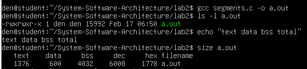
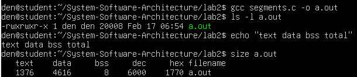
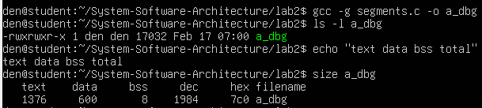
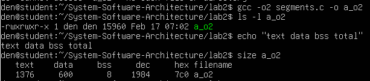
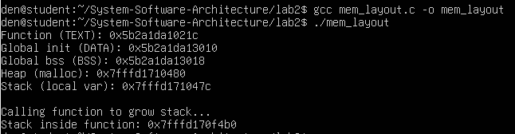
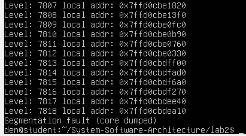

# Практичне заняття №2

## Завдання 1 – Дослідження межі time_t та сегментів виконуваного файлу
### Умова завдання

У цьому завданні потрібно написати програму мовою ANSI C, яка визначає момент, коли тип time_t досягає свого максимального значення. Також необхідно дослідити різницю між 32-бітною та 64-бітною архітектурою і перевірити сегменти виконуваного файлу (text, data, bss) за допомогою команд ls -l, size та nm.

### Теоретична частина

Тип time_t використовується для зберігання часу у вигляді кількості секунд від 1 січня 1970 року (Unix Epoch). Його розмір залежить від архітектури системи. Якщо time_t займає 4 байти (32-bit), його максимальне значення приблизно відповідає даті 19 січня 2038 року -це так звана проблема 2038 року. Якщо ж time_t має 8 байт (64-bit), межа значно більша і знаходиться дуже далеко в майбутньому.

Для визначення максимально можливого значення використовується INT_MAX у випадку 4 байтів і LLONG_MAX у випадку 8 байтів.

### Опис роботи програми

Програма спочатку визначає розмір типу time_t за допомогою sizeof(time_t). Залежно від отриманого значення вона обирає відповідну верхню межу: INT_MAX для 32-бітного випадку або LLONG_MAX для 64-бітного. Далі це значення виводиться як число секунд, після чого за допомогою функції ctime() перетворюється у читабельну дату.

Таким чином можна побачити, до якої дати може “дійти” time_t у конкретній системі та як це залежить від архітектури.
Необхідно написати програму мовою ANSI C, яка визначає момент, коли тип time_t досягає свого максимального значення.

Код програми
```c
#include <stdio.h>
#include <time.h>
#include <limits.h>

int main(void) {

    printf("=== time_t research ===\n");
    printf("sizeof(time_t) = %zu bytes\n", sizeof(time_t));

    time_t t_end;

    if (sizeof(time_t) == 4) {
        t_end = (time_t)INT_MAX;
        printf("Assuming 32-bit time_t.\n");
    } else {
        t_end = (time_t)LLONG_MAX;
        printf("Assuming 64-bit time_t.\n");
    }

    printf("End value = %lld\n", (long long)t_end);

    char *result = ctime(&t_end);

    if (result != NULL) {
        printf("End date = %s", result);
    } else {
        printf("ctime() cannot convert this value on this system.\n");
    }

    return 0;
}
```

### Дослідження 32-bit та 64-bit

Для 64-бітної системи:
```
gcc time_limit.c -o time_limit
./time_limit
```
На скріншоті відображено запуску програми за допомогою 64-бітної системи.


Для 32-бітної збірки (якщо підтримується система):
```
gcc -m32 time_limit.c -o time_limit32
./time_limit32
```
На скріншоті відображено запуску програми за допомогою 32-бітної системи.


Різниця результатів із-за бітності системи:
32-bit	4 байти	~2038 рік
64-bit	8 байт	Дуже далеке майбутнє

Дослідження сегментів виконуваного файлу

Після компіляції виконано аналіз сегментів.

Перевірка розміру файлу:
```
ls -l time_limit
```

Перевірка сегментів:
```
size time_limit
```


На скріншоті відображено результат перевірки сегментів.
Вивід містить:

text — сегмент коду (інструкції)

data — ініціалізовані глобальні змінні

bss — неініціалізовані глобальні змінні

Додатковий аналіз:

nm time_limit


На скріншоті відображено результат додаткового аналізу.

## Завдання 2.2 -Сегменти у виконуваному файлі
Код програми
```c
#include <stdio.h>
#define MODE 1

#if MODE == 2
int g_arr[1000];
#elif MODE == 3
int g_arr[1000] = {1};
#endif

int main (void) {
#if MODE == 4
	int local1[1000];
	int local2[1000] = {1};
	local1[0]=5;
	printf("Hello, world! %d\n", local2[0] + local1[0]);
	#else
		printf("Hello, world!\n");
	#endif
		return 0;
}
```

Для аналізу використовувались команди:
```bash
ls -l a.out
size a.out
```

1) Hello world

На скріншоті відображено результат виконання команди.
2) Глобальний масив int g_arr[1000] (без ініціалізації)
У цьому випадку збільшується сегмент BSS, але розмір файлу майже не змінюється, оскільки BSS не зберігається у виконуваному файлі як дані.

На скріншоті відображено результат виконання команди.
3) Глобальний масив int g_arr[1000] = {1}
Після ініціалізації масив переходить у сегмент DATA, тому збільшується і data у size, і загальний розмір файлу в ls -l.

На скріншоті відображено результат виконання команди.
4) Локальні масиви у функції
Локальні масиви створюються у стеку під час виконання програми, тому не збільшують data/bss. Якщо локальний масив ініціалізований, це може впливати на text, бо ініціалізація відбувається через інструкції.

На скріншоті відображено результат виконання команди.
5) Debug та оптимізація
При компіляції з -g збільшується розмір виконуваного файлу, тому що додається debug-інформація, але text/data/bss майже не змінюються. При -O2 найбільше змінюється сегмент text, оскільки оптимізація впливає на машинний код.


На скріншоті відображено результат виконання команди.


## Завдання 2.3 — Дослідження розташування сегментів пам’яті

У цьому завданні потрібно було дослідити, як у пам’яті процесу розташовуються різні сегменти: text, data, bss, heap та stack. Також потрібно було перевірити, як змінюється вершина стека при виклику функції.

Для цього я написав просту програму, яка виводить адреси різних змінних і функцій. Таким способом можна приблизно побачити, де саме в пам’яті вони знаходяться.

```c
#include <stdio.h>
#include <stdlib.h>

int global_init = 10;  
int global_bss;        

void test_stack() {
    int local_array[1000];
    printf("Stack inside function: %p\n", &local_array);
}

int main() {
    int local_var;
    int *heap_var = malloc(sizeof(int));

    printf("Function (TEXT): %p\n", main);
    printf("Global init (DATA): %p\n", &global_init);
    printf("Global bss (BSS): %p\n", &global_bss);
    printf("Heap (malloc): %p\n", heap_var);
    printf("Stack (local var): %p\n", &local_var);

    printf("Calling function to grow stack...\n");
    test_stack();

    free(heap_var);
    return 0;
}
```

Програма виводить адресу функції main (це сегмент text), адресу ініціалізованої глобальної змінної (це data), адресу неініціалізованої глобальної змінної (це bss), адресу пам’яті з malloc() (це heap) та адресу локальної змінної (це stack).

Після цього викликається функція test_stack(), у якій створюється великий локальний масив. Це дозволяє побачити, як змінюється адреса вершини стека. У більшості систем стек зростає вниз, тобто нові адреси будуть меншими.

Компіляція та запуск
```
gcc mem_layout.c -o mem_layout
./mem_layout
```
На скріншоті відображено результат виконання завдання №3.



## Завдання 2.5 Стек та глибока рекурсія

У цьому завданні потрібно було з’ясувати, чи можна обійтися без лічильника команд (IP), використовуючи тільки стек, а також визначити мінімально необхідний розмір стека для глибокої рекурсії.

Лічильник команд (IP) відповідає за те, яку саме інструкцію процесор виконує в даний момент. Стек використовується для збереження адреси повернення та локальних змінних при виклику функцій. Тобто стек допомагає повернутися назад, але не керує виконанням коду. Тому повністю замінити IP стеком неможливо — без IP процесор просто не знатиме, яку інструкцію виконувати.

Для перевірки роботи стека була використана наступна програма:
```
#include <stdio.h>

void deep(int level) {
    int local[256];
    local[0] = level;

    printf("Level: %d local addr: %p\n", level, (void*)&local);
    deep(level + 1);
}

int main() {
    deep(1);
    return 0;
}
```

У цій програмі функція deep() викликає саму себе, створюючи рекурсію. На кожному рівні створюється локальний масив local[256], який займає пам’ять у стеку. Під час виконання видно, що адреси змінюються — це означає, що стек зростає (зазвичай вниз по пам’яті).

Оскільки кожен виклик займає певну кількість байтів, стек поступово заповнюється. Коли він досягає свого ліміту (наприклад, ~8 МБ у Linux), програма завершується з помилкою переповнення стека (stack overflow).

Отже, стек використовується для збереження викликів функцій і локальних даних, але керування виконанням здійснюється саме через IP. А мінімальний розмір стека для глибокої рекурсії залежить від розміру одного кадру стека, помноженого на кількість рівнів виклику.

На скріншоті відображено результат виконання завдання №5.

