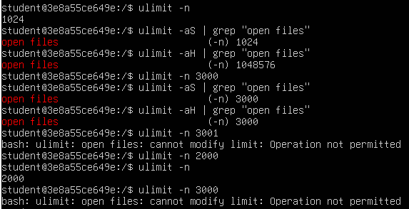
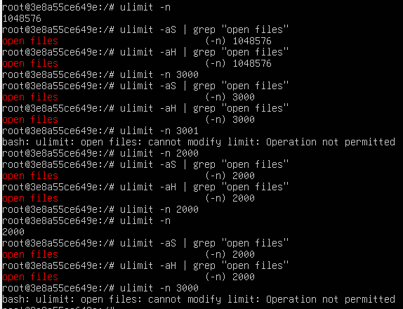
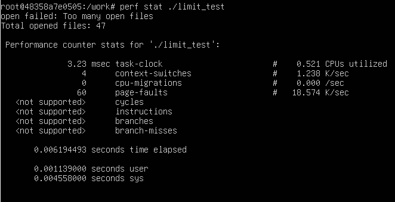
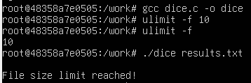
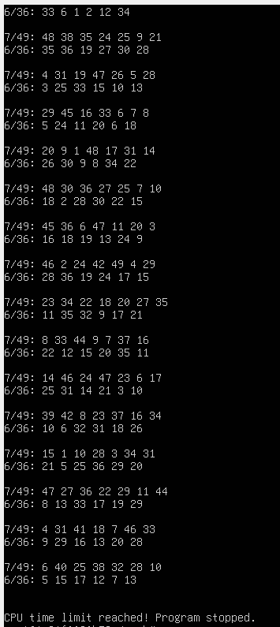
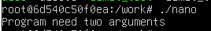
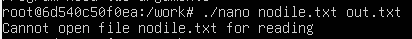
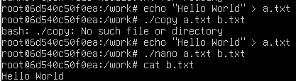
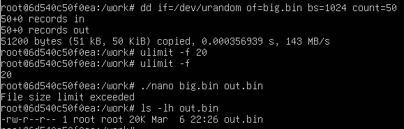

# Лабораторна робота №3  
## Дослідження обмежень ресурсів у середовищі Docker

### Мета роботи

Метою цієї лабораторної роботи є ознайомлення з механізмом обмеження системних ресурсів у Linux.  
Для цього використовується команда `ulimit`, яка дозволяє встановлювати різні обмеження для процесів: наприклад максимальну кількість відкритих файлів, максимальний розмір файлу або час використання процесора.
Також у роботі необхідно перевірити, як ці обмеження впливають на виконання програм, написаних на мові C.

### Підготовка середовища
Оскільки в завданні потрібно використовувати Docker, першим кроком було створення та запуск контейнера.
Контейнер було запущено за допомогою команди:
```
docker run -it --rm --privileged -v "$PWD":/work -w /work ubuntu:24.04 bash
```

Ця команда має кілька параметрів, які важливо розуміти.

Параметр `-it` запускає контейнер у інтерактивному режимі, що дозволяє працювати з ним через термінал.  
Опція `--rm` означає, що контейнер автоматично видалиться після завершення роботи.  
Параметр `-v "$PWD":/work` підключає поточну папку з лабораторною роботою до контейнера. Завдяки цьому файли, які створюються всередині контейнера, фактично зберігаються у файловій системі Ubuntu.  
Параметр `-w /work` встановлює робочу директорію контейнера.

Завдяки цьому всі створені файли залишаються у проекті навіть після завершення контейнера.

### Встановлення необхідних програм

Після запуску контейнера всередині нього була встановлена мінімальна кількість інструментів, які потрібні для виконання лабораторної роботи.

Спочатку було оновлено список пакетів:
```
apt update
```
Після цього встановлено компілятор мови C та текстовий редактор:
```
apt install gcc nano
```
### Проблеми, які виникли
Під час першої спроби запуску Docker з’явилась помилка доступу:
```
permission denied while trying to connect to the Docker daemon
```
Це означає, що поточний користувач не має прав доступу до Docker daemon. Для швидкого вирішення було використання запуску контейнеру через команду sudo:
```
sudo docker run -it --rm --privileged -v "$PWD":/work -w /work ubuntu:24.04 bash
```

# Завдання 3.1
Дослідження обмеження на кількість відкритих файлів

У цьому завданні потрібно було дослідити обмеження на кількість відкритих файлів у Linux за допомогою команди ulimit.
Всі експерименти проводились всередині Docker контейнера.

## Перевірка обмеження без root прав

Спочатку було перевірено поточний ліміт на кількість відкритих файлів.
```
ulimit -n
```
Команда показала значення 1024, тобто процес може одночасно відкрити максимум 1024 файли.

Далі було перевірено soft limit та hard limit.
```
ulimit -aS | grep "open files"
ulimit -aH | grep "open files"
```
Результат показав:

soft limit - 1024

hard limit - 1048576

Це означає, що поточне обмеження становить 1024 файли, але максимальне значення, до якого його можна підняти, набагато більше.

Результат виконання команд


Зміна обмеження

Далі було зроблено спробу змінити значення ліміту.
```
ulimit -n 3000
```
Після цього soft limit змінився на 3000, що можна побачити після повторної перевірки.

Наступним кроком була спроба встановити значення 3001.
```
ulimit -n 3001
```
У цьому випадку система показала помилку:
```
cannot modify limit: Operation not permitted
```
Це означає, що користувач не має достатніх прав для зміни цього значення.

Після цього було встановлено менше значення:
```
ulimit -n 2000
```
Команда
```
ulimit -n
```
показала нове значення 2000.

## Повторення експерименту з правами root

У наступній частині завдання ті самі команди були виконані з правами root.

Спочатку було перевірено поточне значення:
```
ulimit -n
```
Результат показав значення 1048576, що значно більше, ніж у звичайного користувача.

Після цього знову було перевірено soft та hard limit.
```
ulimit -aS | grep "open files"
ulimit -aH | grep "open files"
```
У цьому випадку soft limit і hard limit були однаковими.

Потім було встановлено новий ліміт:
```
ulimit -n 3000
```
Після перевірки було видно, що значення змінилось.

Також була зроблена спроба встановити значення 3001, але система знову показала помилку.

Після цього значення було зменшено до 2000.

Результат виконання команд з root правами



## Висновок

У цьому завданні було досліджено обмеження на кількість відкритих файлів у Linux за допомогою команди ulimit. Під час виконання було перевірено поточні значення soft і hard limit, а також зроблено спроби змінити їх. З’ясувалося, що звичайний користувач може змінювати лише soft limit і тільки в межах hard limit, тоді як перевищити його система не дозволяє. При виконанні тих самих команд з правами root доступні більші значення обмежень, що дає більше можливостей для їх зміни. Це показує, як система контролює використання ресурсів процесами.

# Завдання 3.2
Використання утиліти perf

У цьому завданні потрібно було ознайомитися з роботою утиліти perf, яка використовується для аналізу продуктивності програм у Linux. За допомогою цієї утиліти можна отримати статистику виконання програми, наприклад час роботи процесора, кількість перемикань контексту та інші показники.

Всі експерименти виконувались всередині Docker контейнера.

Спочатку у контейнері було встановлено необхідні інструменти. Для цього виконано команду:
```
apt update
apt install linux-tools-generic gcc
```
Після цього було скомпільовано тестову програму, яка відкриває багато файлів, щоб досягти встановленого обмеження.
```
gcc limit_test.c -o limit_test
```
Далі було встановлено обмеження на кількість відкритих файлів:
```
ulimit -n 50
```
Це означає, що процес може одночасно відкрити не більше 50 файлів.

Після встановлення обмеження програма була запущена через утиліту perf:
```
perf stat ./limit_test
```
У результаті виконання програми з’явилось повідомлення:
```
open failed: Too many open files
Total opened files: 47
```
Це означає, що програма намагалася відкрити більше файлів, ніж дозволяє встановлений ліміт, тому система зупинила відкриття нових файлів.

Також утиліта perf показала статистику виконання програми, зокрема:

час використання процесора

кількість перемикань контексту

кількість помилок сторінок пам’яті

Ці дані дозволяють оцінити, як програма використовує ресурси системи.

Результат виконання програми



### Висновок

У цьому завданні було досліджено роботу утиліти perf та перевірено, як програма поводиться при досягненні встановленого ліміту на кількість відкритих файлів. Під час виконання стало видно, що при перевищенні цього обмеження система видає помилку Too many open files. Також було отримано статистику роботи програми за допомогою perf, що дозволяє краще зрозуміти використання системних ресурсів.


# Завдання 3.3
Імітація кидання кубика з обмеженням розміру файлу

У цьому завданні потрібно було написати програму, яка імітує кидання шестигранного кубика. Програма генерує випадкові числа від 1 до 6 та записує результати у файл. Основна мета завдання - перевірити, як працює обмеження на максимальний розмір файлу у Linux.

Спочатку програму було скомпільовано за допомогою компілятора gcc.
```
gcc dice.c -o dice
```
Після компіляції було встановлено обмеження на максимальний розмір файлу за допомогою команди:
```
ulimit -f 10
```
Це означає, що програма може записати у файл тільки обмежений обсяг даних. Коли файл досягає цього ліміту, система не дозволяє записувати нові дані.

Після встановлення обмеження програму було запущено:
```
./dice results.txt
```
Під час виконання програма генерує результати кидання кубика та записує їх у файл. Коли файл досягає встановленого обмеження, запис припиняється і програма виводить повідомлення:
```
File size limit reached!
```
Запуск програми



На цьому скріншоті видно компіляцію програми, встановлення обмеження за допомогою ulimit, а також запуск програми, після якого з’являється повідомлення про перевищення ліміту.

Перевірка створеного файлу

Після завершення роботи програми було перевірено розмір створеного файлу.
```
ls -lh results.txt
```
Результат показав, що файл має розмір 10K, тобто саме той ліміт, який було встановлено раніше.

.png)

### Висновок

У цьому завданні було перевірено, як працює обмеження на максимальний розмір файлу. Після встановлення ліміту за допомогою ulimit програма могла записувати дані лише до моменту досягнення цього обмеження. Коли файл досяг встановленого розміру, система зупинила подальший запис і програма повідомила про перевищення ліміту. Це показує, що Linux контролює використання ресурсів і не дозволяє процесам перевищувати встановлені обмеження.

# Завдання 3.4
Імітація лотереї з обмеженням часу процесора

У цьому завданні потрібно було написати програму, яка імітує роботу лотереї. Програма генерує два набори випадкових чисел:

7 різних чисел у діапазоні від 1 до 49

6 різних чисел у діапазоні від 1 до 36

Результати генерації чисел виводяться у термінал. Програма працює у циклі та постійно генерує нові набори чисел.

Основна мета цього завдання - дослідити, як працює обмеження на час використання процесора (CPU time).

Компіляція програми

Спочатку програму було скомпільовано за допомогою компілятора gcc.
```
gcc lottery.c -o lottery
```
Після цього було встановлено обмеження на час використання процесора.
```
ulimit -t 1
```
Ця команда означає, що програмі дозволено використовувати процесор не більше 1 секунди.

Запуск програми

Після встановлення обмеження програма була запущена:
```
./lottery
```
Під час виконання програма генерує випадкові числа та виводить їх у термінал. На скріншоті можна побачити кілька наборів результатів для лотереї 7/49 та 6/36.

Результат роботи програми



Через деякий час після запуску з’являється повідомлення:
```
CPU time limit reached! Program stopped.
```
Це означає, що програма використала весь дозволений час процесора і була зупинена.

### Висновок

У цьому завданні було перевірено, як працює обмеження на час використання процесора. Після встановлення ліміту за допомогою ulimit програма могла виконуватися лише певний час. Коли цей час закінчився, система автоматично зупинила програму. Це показує, що Linux контролює використання процесора і не дозволяє процесам працювати довше, ніж встановлено системними обмеженнями.

# Завдання 3.5
Програма копіювання файлу

У цьому завданні потрібно було написати програму, яка копіює вміст одного файлу в інший. Імена файлів передаються програмі як аргументи командного рядка. Також програма повинна перевіряти різні помилки, наприклад неправильну кількість аргументів або неможливість відкрити файл.

Програму було скомпільовано за допомогою компілятора gcc.
```
gcc copy.c -o copy
```
Після компіляції було проведено кілька перевірок роботи програми.

Перевірка кількості аргументів

Спочатку програму було запущено без аргументів:
```
./nano
```
У цьому випадку програма вивела повідомлення:

Program need two arguments

Це означає, що програма перевіряє кількість переданих аргументів і повідомляє користувача про помилку.



Перевірка відкриття файлу для читання

Далі було зроблено спробу запустити програму з файлом, який не існує.
```
./copy nodfile.txt out.txt
```
У цьому випадку програма вивела повідомлення:
```
Cannot open file nodfile.txt for reading
```
Це означає, що програма перевіряє, чи існує файл для читання.



Нормальна робота програми

Далі було створено тестовий файл:
```
echo "Hello World" > a.txt
```
Після цього програму було запущено для копіювання:
```
./copy a.txt b.txt
```
Для перевірки результату було використано команду:
```
cat b.txt
```
У результаті вміст файлу успішно скопіювався.



Перевищення обмеження розміру файлу

Для перевірки обмеження розміру файлу спочатку було створено великий файл:
```
dd if=/dev/urandom of=big.bin bs=1024 count=50
```
Після цього було встановлено обмеження:
```
ulimit -f 20
```
Далі програму було запущено для копіювання великого файлу.

У результаті система показала повідомлення:
```
File size limit exceeded
```
Після цього було перевірено розмір створеного файлу:
```
ls -lh out.bin
```
Файл мав розмір 20K, тобто досяг встановленого ліміту.



### Висновок

У цьому завданні було реалізовано програму копіювання файлу з перевіркою аргументів і обробкою можливих помилок. Було перевірено різні ситуації: запуск без аргументів, спробу відкрити неіснуючий файл, нормальне копіювання та перевищення обмеження розміру файлу. Під час експерименту стало видно, що система контролює розмір створюваного файлу і не дозволяє перевищувати встановлений ліміт.


