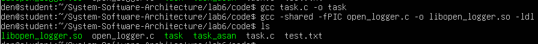

# Практична робота №6
## Інструменти налагодження для проблем з пам’яттю

У цій лабораторній роботі досліджуються інструменти налагодження програм у середовищі Linux. Особливу увагу приділено аналізу викликів системних функцій та можливості їх перехоплення для подальшого аналізу роботи програми.

Одним із підходів до аналізу роботи програм є використання механізму LD_PRELOAD, який дозволяє підміняти стандартні функції бібліотек власними реалізаціями. Це дає змогу перехоплювати виклики функцій та отримувати додаткову інформацію про їх параметри.

Також у роботі використовується інструмент strace, який дозволяє відслідковувати системні виклики програми під час її виконання.

## Завдання 6.6

Створити динамічну бібліотеку з використанням механізму LD_PRELOAD, яка перехоплює виклик функції open() та виводить у консоль її параметри.

Після цього необхідно порівняти роботу цього підходу з використанням інструменту strace, який дозволяє спостерігати системні виклики програми.

## Код тестової програми

Було створено просту програму на мові C, яка відкриває файл за допомогою функції open().
```c
#include <stdio.h>
#include <fcntl.h>
#include <unistd.h>

int main() {
    int fd = open("test.txt", O_RDONLY);

    if (fd == -1) {
        perror("open failed");
        return 1;
    }

    printf("File opened successfully, fd = %d\n", fd);

    close(fd);
    return 0;
}
```
Ця програма використовується для демонстрації виклику функції open() та перевірки роботи механізму перехоплення викликів.

## Код бібліотеки для перехоплення open()

Було створено динамічну бібліотеку, яка перевизначає функцію open() та виводить параметри виклику.
```c
#define _GNU_SOURCE
#include <stdio.h>
#include <dlfcn.h>
#include <fcntl.h>
#include <stdarg.h>

int open(const char *pathname, int flags, ...) {

    static int (*real_open)(const char *pathname, int flags, ...) = NULL;

    if (!real_open) {
        real_open = dlsym(RTLD_NEXT, "open");
    }

    printf("[LD_PRELOAD] open called: pathname=%s, flags=%d\n", pathname, flags);

    return real_open(pathname, flags);
}
```
У цій бібліотеці використовується функція dlsym(), яка дозволяє отримати адресу оригінальної функції open() з системної бібліотеки. Після виведення інформації про виклик керування передається справжній функції.

### Компіляція програми

Компіляція тестової програми виконується за допомогою компілятора gcc:
```
gcc task.c -o task
```
### Компіляція динамічної бібліотеки виконується командою:
```
gcc -shared -fPIC open_logger.c -o libopen_logger.so -ldl
```
### Скріншот компіляції:

Запуск програми без перехоплення



### Спочатку програма запускається у звичайному режимі:
```
./task
```
Результат виконання:

File opened successfully, fd = 3

У цьому випадку функція open() викликається стандартною бібліотекою без додаткового логування.

Скріншот запуску:

### Запуск програми з використанням LD_PRELOAD

Для перехоплення виклику функції використовується змінна середовища LD_PRELOAD:
```
LD_PRELOAD=./libopen_logger.so ./task
```
Результат виконання:
```
[LD_PRELOAD] open called: pathname=test.txt, flags=0
File opened successfully, fd = 3
```
Як видно з результату, бібліотека успішно перехоплює виклик функції open() та виводить її параметри.

Скріншот виконання:


### Використання strace

Для порівняння було використано інструмент strace, який дозволяє відслідковувати системні виклики програми.

Команда запуску:
```
strace ./task 2>&1 | grep open
```
Результат:
```
openat(AT_FDCWD, "test.txt", O_RDONLY) = 3
```
У цьому випадку видно системний виклик openat, який використовується сучасними версіями Linux для відкриття файлів.

### Скріншот роботи:


### Порівняння підходів

Підхід із використанням LD_PRELOAD дозволяє безпосередньо перехоплювати виклики функцій бібліотек та змінювати або логувати їх поведінку. Це дає змогу більш гнучко контролювати виконання програми.

Інструмент strace працює зовні та відображає системні виклики програми під час її виконання. Він не змінює поведінку програми, а лише дозволяє спостерігати за її роботою.

Таким чином, LD_PRELOAD використовується для модифікації або перехоплення функцій, тоді як strace застосовується для аналізу виконання програм.

### Висновок

У ході виконання лабораторної роботи було досліджено механізм перехоплення функцій у Linux за допомогою LD_PRELOAD.

Було створено динамічну бібліотеку, яка перехоплює виклик функції open() та виводить її параметри у консоль. Також було проведено аналіз системних викликів за допомогою інструменту strace.

Отримані результати показали, що механізм LD_PRELOAD дозволяє змінювати або розширювати поведінку стандартних функцій, тоді як strace використовується для зовнішнього аналізу роботи програми.

