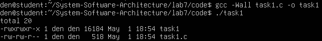

# Практична робота №7
## Дослідження, моделювання та нестандартні підходи до аналізу процесів, файлових систем, безпеки та ресурсів в Linux

### Мета роботи
У цій лабораторній роботі досліджуються низькорівневі можливості Linux, пов’язані з процесами, файловою системою, правами доступу та системними викликами.
Особливу увагу приділено написанню власних спрощених аналогів стандартних UNIX-утиліт, таких як ls, grep, more, а також роботі з каталогами, файлами, правами доступу та вимірюванням часу виконання коду.

# Завдання 1 
У цьому завданні було досліджено роботу функції popen(), яка дозволяє запускати системні команди безпосередньо з програми на мові C та отримувати їх результат. За умовою потрібно було передати вивід команди rwho до more, але у середовищі Ubuntu у VirtualBox ця команда не працювала коректно. Тому для демонстрації було використано команду ls -l, яка також дозволяє перевірити механізм передачі виводу.

У результаті програма відкриває процес, виконує команду і зчитує її результат як звичайний потік даних. Це дозволяє обробляти вивід команд прямо в коді програми. Таким чином було перевірено, що popen() працює як міст між C-програмою і командною оболонкою Linux.

## Код програми
Код програми розміщено у файлі: code/task1.c

## Компіляція програми
```
gcc -Wall task1.c -o task1
```
## Запуск програми
```
./task1
```
## Результати виконання


Після запуску програма вивела список файлів поточного каталогу разом із їх правами доступу та розміром. Це означає, що команда була успішно виконана, а її результат правильно зчитаний через popen().

На скріншоті видно, що програма відображає файли та їх характеристики, як це робить стандартна команда ls -l. Це підтверджує правильність реалізації.
