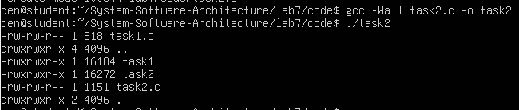
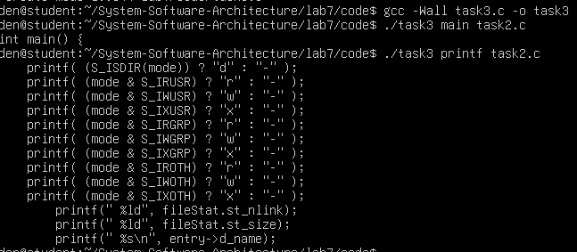
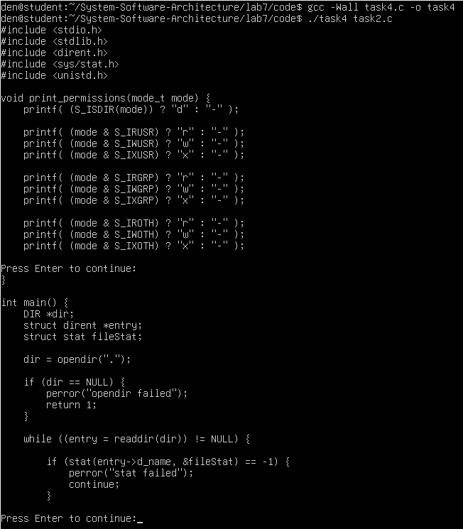
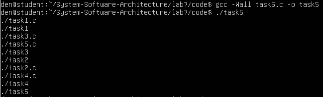
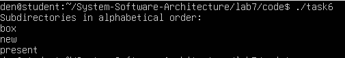
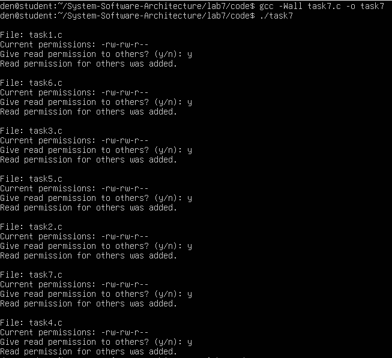
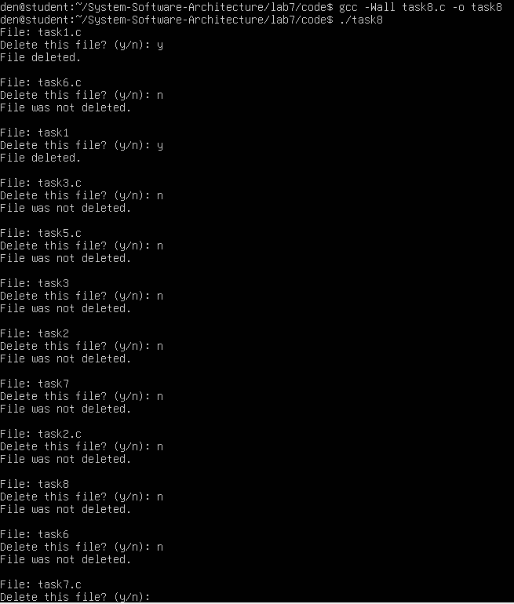

# Практична робота №7
## Дослідження, моделювання та нестандартні підходи до аналізу процесів, файлових систем, безпеки та ресурсів в Linux

### Мета роботи
У цій лабораторній роботі досліджуються низькорівневі можливості Linux, пов’язані з процесами, файловою системою, правами доступу та системними викликами.
Особливу увагу приділено написанню власних спрощених аналогів стандартних UNIX-утиліт, таких як ls, grep, more, а також роботі з каталогами, файлами, правами доступу та вимірюванням часу виконання коду.

## Завдання 1 
У цьому завданні було досліджено роботу функції popen(), яка дозволяє запускати системні команди безпосередньо з програми на мові C та отримувати їх результат. За умовою потрібно було передати вивід команди rwho до more, але у середовищі Ubuntu у VirtualBox ця команда не працювала коректно. Тому для демонстрації було використано команду ls -l, яка також дозволяє перевірити механізм передачі виводу.

У результаті програма відкриває процес, виконує команду і зчитує її результат як звичайний потік даних. Це дозволяє обробляти вивід команд прямо в коді програми. Таким чином було перевірено, що popen() працює як міст між C-програмою і командною оболонкою Linux.

### Код програми
Код програми розміщено у файлі: code/task1.c

### Компіляція програми
```
gcc -Wall task1.c -o task1
```
### Запуск програми
```
./task1
```

### Результати виконання


Після запуску програма вивела список файлів поточного каталогу разом із їх правами доступу та розміром. Це означає, що команда була успішно виконана, а її результат правильно зчитаний через popen().

На скріншоті видно, що програма відображає файли та їх характеристики, як це робить стандартна команда ls -l. Це підтверджує правильність реалізації.

## Завдання 2
У цьому завданні було реалізовано власний аналог команди ls -l без використання самої команди. Для цього використовувалися функції opendir(), readdir() та stat(), які дозволяють працювати з каталогами і отримувати інформацію про файли. Основна складність полягала у правильному визначенні та виведенні прав доступу у форматі rwx.

Програма проходить по всіх файлах у поточному каталозі, отримує інформацію про кожен файл і формує рядок, який містить права доступу, розмір та ім’я файлу. У результаті вивід виглядає дуже схоже на стандартну команду ls -l, але реалізований повністю вручну.

### Код програми
Код програми розміщено у файлі: code/task2.c

### Компіляція програми
```
gcc -Wall task2.c -o task2
```

### Запуск програми
```
./task2
```

### Результати виконання


У результаті виконання програма вивела список файлів разом із їх правами доступу та розміром. Формат виводу відповідає стандартному вигляду ls -l, що підтверджує правильність реалізації.

На скріншоті видно, що для кожного файлу виводиться інформація у вигляді -rwxrwxr-x, що означає права доступу для власника, групи та інших користувачів. Таким чином було продемонстровано роботу з файловою системою на низькому рівні.

## Завдання 3 
У цьому завданні було реалізовано спрощений аналог команди grep, яка використовується для пошуку тексту у файлах. Програма приймає два аргументи: слово для пошуку та ім’я файлу. Далі вона відкриває файл і зчитує його по рядках, перевіряючи, чи містить рядок потрібне слово.

Якщо слово знайдено, рядок виводиться у консоль. Для пошуку використовується функція strstr(), яка дозволяє перевірити наявність підрядка. Таким чином було реалізовано базовий механізм пошуку тексту у файлі.

### Код програми
Код програми розміщено у файлі: code/task3.c

### Компіляція програми
gcc -Wall task3.c -o task3

### Запуск програми
./task3 main task2.c

### Результати виконання


Після запуску програма вивела лише ті рядки з файлу, які містять задане слово. Це підтверджує, що пошук працює правильно і обробка файлу виконується коректно.

На скріншоті видно, що були знайдені рядки з функцією main або printf. Це означає, що програма правильно аналізує текст і знаходить потрібні входження.

## Завдання 4
У цьому завданні було реалізовано спрощений аналог команди more, яка використовується для перегляду файлів посторінково. Основна ідея полягає в тому, щоб виводити файл не повністю одразу, а частинами, наприклад по 20 рядків. Після цього програма зупиняється і чекає дії користувача, щоб продовжити вивід.

Програма відкриває файл, читає його по рядках і рахує кількість виведених рядків. Після кожних 20 рядків вона виводить повідомлення і очікує натискання клавіші Enter. Це дозволяє зручно переглядати великі файли і не перевантажувати термінал великою кількістю тексту одразу.

### Код програми
Код програми розміщено у файлі: code/task4.c

### Компіляція програми
gcc -Wall task4.c -o task4

### Запуск програми
./task4 task2

### Результати виконання


Після запуску програма почала виводити вміст файлу task2.c, але не повністю, а частинами по 20 рядків. Після кожної такої частини з’являється повідомлення про продовження, що підтверджує правильну роботу механізму паузи.

На скріншоті видно момент зупинки програми та очікування натискання клавіші. Це означає, що реалізована логіка працює правильно і програма поводиться аналогічно до утиліти more.

## Завдання 5 
У цьому завданні було реалізовано програму, яка виводить всі файли у поточному каталозі та у всіх вкладених підкаталогах. Основна складність полягає в тому, щоб правильно обійти структуру каталогів і не зациклитися.

Для цього використовується рекурсія: якщо програма знаходить каталог, вона викликає саму себе для цього каталогу. Таким чином відбувається повний обхід файлової системи, починаючи з поточного каталогу.
### Код програми
Код програми розміщено у файлі: code/task5.c

### Компіляція програми
gcc -Wall task5.c -o task5
### Запуск програми
./task5
### Результати виконання


У результаті програма вивела всі файли, які знаходяться у поточному каталозі, а також у вкладених папках. Це означає, що рекурсивний обхід працює правильно.

На скріншоті видно список файлів з різних рівнів вкладеності, що підтверджує коректну реалізацію обходу каталогів.

## Завдання 6
У цьому завданні потрібно було вивести лише підкаталоги поточного каталогу і відсортувати їх у алфавітному порядку. Для цього спочатку всі знайдені каталоги зберігаються у масив, а потім сортуються за допомогою функції qsort().

Програма перевіряє кожен файл у каталозі, визначає, чи є він директорією, і додає його до списку. Після цього список сортується і виводиться у консоль.

### Код програми
Код програми розміщено у файлі: code/task6.c

### Компіляція програми
gcc -Wall task6.c -o task6

### Запуск програми
./task6

### Результати виконання


Після запуску програма вивела список підкаталогів у відсортованому вигляді. Це означає, що сортування було виконано правильно.

На скріншоті видно, що назви каталогів розташовані у правильному алфавітному порядку, що підтверджує коректну роботу програми.

## Завдання 7 
У цьому завданні було реалізовано програму, яка знаходить всі файли з розширенням .c і дозволяє користувачу змінювати права доступу до них. Програма питає, чи потрібно надати право читання для інших користувачів.

Для зміни прав використовується функція chmod(). Програма отримує поточні права файлу і додає або залишає без змін право читання для інших користувачів залежно від відповіді користувача.

### Код програми
Код програми розміщено у файлі: code/task7.c

### Компіляція програми
gcc -Wall task7.c -o task7

### Запуск програми
./task7

### Результати виконання


Після запуску програма по черзі вивела .c файли і запропонувала змінити їх права доступу. Після підтвердження права були змінені.

На скріншоті видно повідомлення про додавання прав доступу, що підтверджує правильну роботу функції chmod().

## Завдання 8
У цьому завданні було реалізовано інтерактивне видалення файлів. Програма перебирає всі файли у поточному каталозі і запитує користувача, чи потрібно видалити кожен з них.

Якщо користувач вводить y, файл видаляється за допомогою функції remove(). Це дозволяє контролювати процес видалення і уникнути випадкової втрати даних.

### Код програми
Код програми розміщено у файлі: code/task8.c

### Компіляція програми
gcc -Wall task8.c -o task8

### Запуск програми
./task8

### Результати виконання


Після запуску програма запропонувала видалити файли у поточному каталозі. Частина файлів була видалена після підтвердження.

На скріншоті видно процес видалення файлів, що підтверджує коректну роботу програми.

