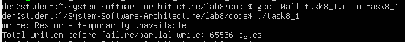
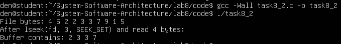
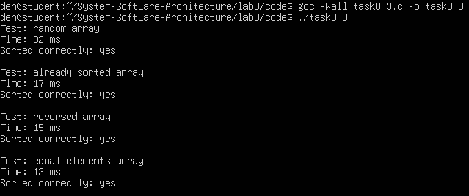
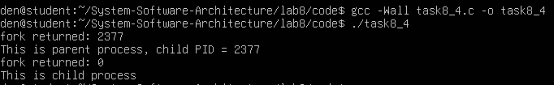
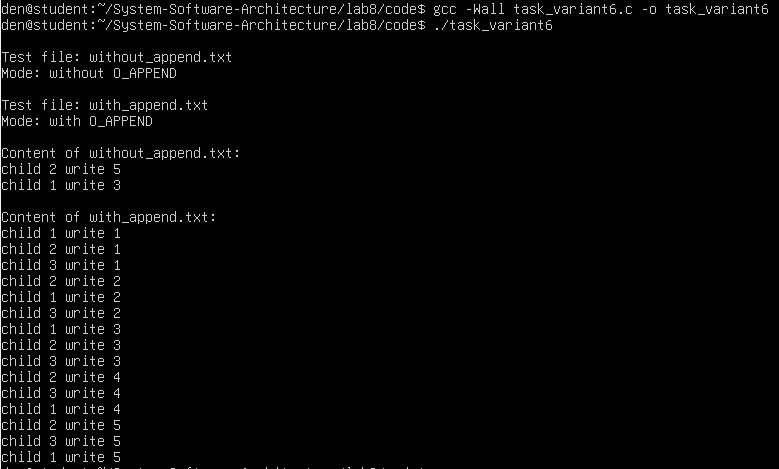

# Практична робота №8
## Системні виклики в UNIX/POSIX (write, read, lseek, fork, qsort)

### Мета роботи
У цій лабораторній роботі досліджуються системні виклики UNIX/POSIX, які використовуються для роботи з файлами та процесами. Основна увага приділяється таким функціям, як write(), read(), lseek(), fork(), а також сортуванню через qsort().

У ході роботи було розглянуто, як поводяться файлові дескриптори, як працює зміщення в файлі, як створюються процеси та як вхідні дані впливають на швидкість роботи алгоритмів.

## Завдання 8.1 
У цьому завданні потрібно було перевірити, чи може функція write() повернути значення, відмінне від кількості переданих байтів. Для цього було використано pipe у неблокуючому режимі.

У результаті виконання було встановлено, що після заповнення буфера pipe функція write() повертає помилку, і запис не виконується. Це означає, що write() не гарантує запис усіх переданих даних і її поведінка залежить від стану системи.

### Код програми
Код програми розміщено у файлі: code/task8_1.c

### Компіляція програми
```
gcc -Wall task8_1.c -o task8_1
```
### Запуск програми
```
./task8_1
```

### Результати виконання


Після запуску програми було видно, що функція write() спочатку записує дані у pipe, але після заповнення його буфера повертає помилку "Resource temporarily unavailable". Це означає, що запис більше неможливий у даний момент часу.

На скріншоті видно, що загальна кількість записаних байтів становить 65536, що відповідає розміру буфера pipe. Після цього запис припиняється, що підтверджує, що write() може повернути значення, відмінне від nbytes, або взагалі завершитися з помилкою.

Таким чином було експериментально підтверджено, що результат write() залежить від стану системних ресурсів і не гарантує запис усіх переданих даних.

## Завдання 8.2
У цьому завданні було досліджено роботу функцій lseek() та read(). Програма створює файл з певною послідовністю байтів і змінює позицію читання.

Після виклику lseek(fd, 3, SEEK_SET) позиція зміщується на 4-й елемент, після чого read() читає наступні 4 байти. У результаті було отримано значення 2 3 3 7.

### Код програми
Код програми розміщено у файлі: code/task8_2.c

### Компіляція програми
gcc -Wall task8_2.c -o task8_2

### Запуск програми
./task8_2

### Результати виконання


Після виконання програми було виведено початкову послідовність байтів у файлі, а також результат читання після зміщення позиції.

На скріншоті видно, що після виклику lseek(fd, 3, SEEK_SET) позиція змістилась на четвертий елемент масиву. Подальший виклик read() прочитав 4 байти, і у буфері опинились значення 2 3 3 7.

Це підтверджує, що функція lseek() коректно змінює позицію читання у файлі, а read() починає читати саме з цієї позиції.

## Завдання 8.3
У цьому завданні було досліджено роботу функції qsort() для різних типів масивів. Було створено кілька наборів даних: випадковий масив, відсортований, обернений та масив з однакових значень.

Було встановлено, що час виконання сортування залежить від структури вхідних даних. Випадковий масив сортується довше, ніж інші варіанти, що показує залежність ефективності алгоритму від даних.

### Код програми
Код програми розміщено у файлі: code/task8_3.c

### Компіляція програми
gcc -Wall task8_3.c -o task8_3

### Запуск програми
./task8_3

### Результати виконання


У результаті виконання програми було отримано час сортування для різних типів масивів. На скріншоті видно, що випадковий масив обробляється найдовше, тоді як вже відсортований, обернений та масив з однакових значень виконуються швидше.

Також для кожного випадку було перевірено, що масив відсортований правильно, що підтверджується повідомленням "Sorted correctly: yes".

Отримані результати показують, що продуктивність qsort() залежить від структури вхідних даних, що важливо враховувати при роботі з великими масивами.

## Завдання 8.4 
У цьому завданні було досліджено роботу системного виклику fork(). Після виклику створюється новий процес, і програма починає виконуватись у двох процесах.

Було встановлено, що у батьківському процесі fork() повертає PID дочірнього процесу, а у дочірньому - значення 0. Порядок виконання може змінюватися.

### Код програми
Код програми розміщено у файлі: code/task8_4

### Компіляція програми
gcc -Wall task8_4.c -o task8_4

### Запуск програми
./task8_4

### Результати виконання


Після запуску програми було отримано два виводи, що пов’язано з роботою fork(). На скріншоті видно, що в одному випадку функція повертає значення, відмінне від нуля - це батьківський процес, який отримує PID дочірнього процесу.

У другому випадку функція fork() повертає 0, що означає виконання у дочірньому процесі. Таким чином програма виконується у двох процесах одночасно.

Порядок виводу може змінюватися при різних запусках, що пов’язано з роботою планувальника операційної системи.

## Завдання по варіантам (варіант 6)
У цьому завданні було проведено експеримент, який показує вплив використання прапора O_APPEND на поведінку write() у багатопроцесній програмі.

Було встановлено, що без O_APPEND процеси можуть перезаписувати дані один одного, оскільки запис відбувається з поточної позиції файлу. При використанні O_APPEND кожен запис додається в кінець файлу, що дозволяє зберегти всі дані.

### Код програми
Код програми розміщено у файлі: code/task_variant6.c

### Компіляція програми
gcc -Wall task_variant6.c -o task_variant6

### Запуск програми
./task_variant6

### Результати виконання


У результаті виконання програми було отримано два файли: без використання O_APPEND та з його використанням.

На скріншоті видно, що у файлі without_append.txt міститься лише кілька рядків, хоча процеси виконували багато записів. Це означає, що частина даних була перезаписана іншими процесами.

У файлі with_append.txt, навпаки, присутні всі записи від усіх процесів. Порядок записів перемішаний, що пов’язано з паралельним виконанням, але жоден запис не втрачено.

Це підтверджує, що використання O_APPEND гарантує додавання даних у кінець файлу і запобігає їх перезапису у багатопроцесному середовищі.
