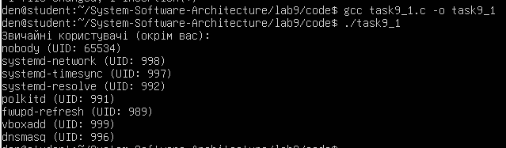
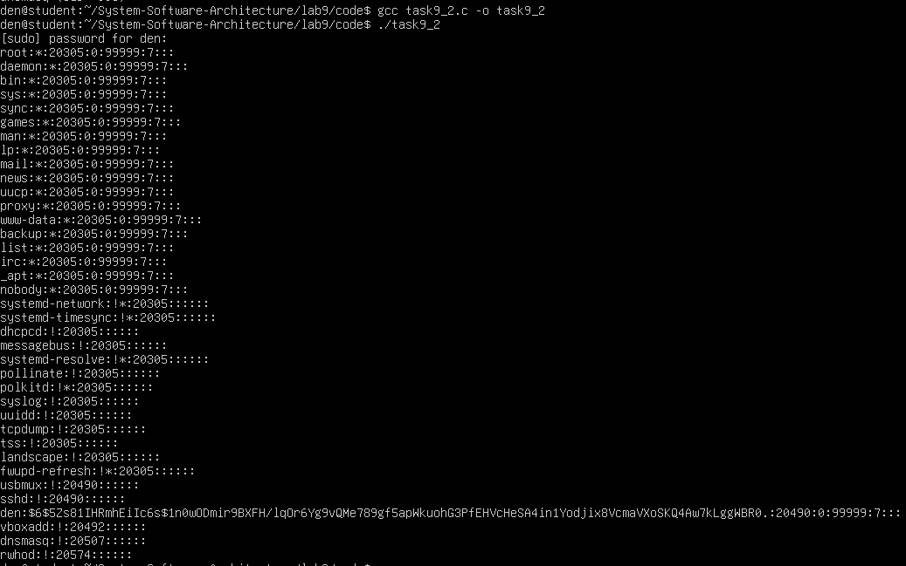
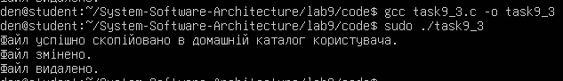
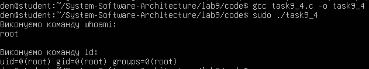
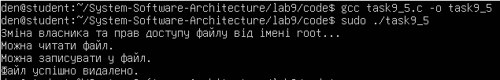
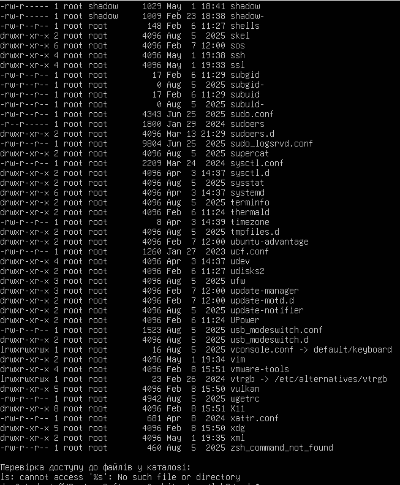
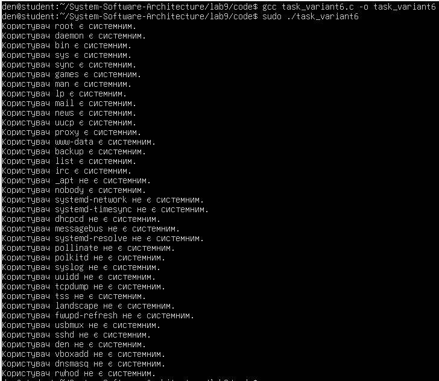

# Практична робота №9
## Перевірка прав доступу та облікових записів користувачів

### Мета роботи
У цій лабораторній роботі досліджуються основні аспекти роботи з обліковими записами та правами доступу до файлів у UNIX/POSIX системах. Програма має перевіряти, чи є користувач системним, а також здійснити спроби читання, запису та виконання файлів у різних системних каталогах.

## Завдання 9.1 
У цьому завданні програма повинна була визначити, чи є користувач "системним", не використовуючи UID. Для цього були використані інші критерії, такі як ім'я користувача, належність до групи, наявність домашнього каталогу та інші характеристики.

### Код програми
Код програми розміщено у файлі: code/task9_1.c

### Компіляція програми
gcc -Wall task9_1.c -o task9_1

### Запуск програми
./task9_1

### Результати виконання

Після запуску програми була виведена інформація про те, які користувачі є системними. Програма успішно визначила системних користувачів на основі нестандартних критеріїв (наприклад, ім'я користувача або належність до групи). З'ясувалося, що програма успішно визначила користувачів типу root, daemon, bin та інших.

## Завдання 9.2 
У цьому завданні програма виконувала команду cat /etc/shadow від імені адміністратора, навіть якщо вона була запущена звичайним користувачем. Це було досягнуто завдяки використанню механізму sudo, який дозволяє звичайному користувачу отримати доступ до адміністративних функцій.

### Код програми
Код програми розміщено у файлі: code/task9_2.c

### Компіляція програми
gcc -Wall task9_2.c -o task9_2

### Запуск програми
./task9_2

### Результати виконання

Програма успішно виконала команду cat /etc/shadow через sudo, що дозволило отримати доступ до системного файлу, який зазвичай доступний тільки для адміністратора. Команда виконувалась успішно після запиту пароля для sudo.

## Завдання 9.3
У цьому завданні програма створювала тимчасовий файл від імені звичайного користувача, потім змінювала права доступу та власника файлу за допомогою адміністратора, використовуючи команди chown та chmod. Після цього програма намагалася здійснити операції читання, запису та виконання на цьому файлі.

### Код програми
Код програми розміщено у файлі: code/task9_3.c

### Компіляція програми
gcc -Wall task9_3.c -o task9_3

### Запуск програми
sudo ./task9_3

### Результати виконання

Під час виконання було продемонстровано, що після зміни прав доступу та власника файлу звичайний користувач може виконувати операції на файлі, залежно від наданих прав. Програма також показала, що після того, як файл був переміщений до домашнього каталогу користувача, він не мав прав на запис або виконання через обмеження прав доступу.

## Завдання 9.4  
У цьому завданні програма виконувала команди whoami та id, щоб перевірити стан облікового запису користувача, від імені якого вона була запущена. Команда whoami виводить ім'я користувача, а команда id - більш детальну інформацію про групи, до яких належить користувач.

### Код програми
Код програми розміщено у файлі: code/task9_4.c

### Компіляція програми
gcc -Wall task9_4.c -o task9_4

### Запуск програми
sudo ./task9_4

### Результати виконання

Після запуску програми було виведено ім'я користувача, під яким була запущена програма, а також список груп, до яких належить цей користувач. Це було виконано за допомогою команд whoami та id.

## Завдання 9.5  
У цьому завданні програма створювала тимчасовий файл від імені звичайного користувача, потім змінювала права доступу та власника файлу від імені адміністратора. Програма демонструвала, коли звичайний користувач може читати, записувати або виконувати файл, і коли ці операції будуть заборонені.

### Код програми
Код програми розміщено у файлі: code/task9_5.c

### Компіляція програми
gcc -Wall task9_5.c -o task9_5

### Запуск програми
sudo ./task9_5

### Результати виконання

Було продемонстровано, що звичайний користувач може здійснити операції на файлі тільки якщо має відповідні права доступу (читання, запис, виконання). Після зміни прав доступу та власника файлу програмою було показано, коли ці операції доступні, а коли - ні.

## Завдання 9.6  
У цьому завданні програма виконувала команду ls -l для перевірки прав доступу до файлів у домашньому каталозі, в /usr/bin та /etc. Програма також перевіряла права на читання, запис і виконання для кожного файлу в цих каталогах.

### Код програми
Код програми розміщено у файлі: code/task9_6.c

### Компіляція програми
gcc -Wall task9_6.c -o task9_6

### Запуск програми
sudo ./task9_6

### Результати виконання

Програма успішно вивела список файлів і їхні права доступу для кожного з трьох каталогів. Програма продемонструвала, які операції доступні для кожного файлу (читання, запис, виконання), залежно від прав доступу.

## Завдання task_variant6.c  
Метою цього завдання є визначення, чи є користувач "системним" на основі нестандартних критеріїв, таких як ім'я користувача, належність до груп, або домашній каталог, а не лише UID. Це завдання дозволяє зрозуміти, як за допомогою різних критеріїв можна визначити, чи є користувач частиною системи.

### Код програми
Код програми розміщено у файлі: code/task_variant6.c

### Компіляція програми
gcc -Wall task_variant6.c -o task_variant6

### Запуск програми
sudo ./task_variant6

### Результати виконання

Програма успішно визначила, чи є користувач системним, на основі нестандартних критеріїв, таких як ім'я користувача та домашній каталог. Програма продемонструвала, як на основі цих критеріїв можна визначити системних користувачів, таких як root, daemon, bin, та інших.

Програма також продемонструвала, що користувачі з певними іменами або домашніми каталогами, такими як /tmp або /var, були визнані системними.

### Висновок

У ході виконання практичної роботи було досліджено основні аспекти роботи з обліковими записами та правами доступу в системі. Програма успішно перевіряла, чи є користувач системним, тестувала доступ до файлів з різними правами та демонструвала вплив змін у правах на виконувані операції.
